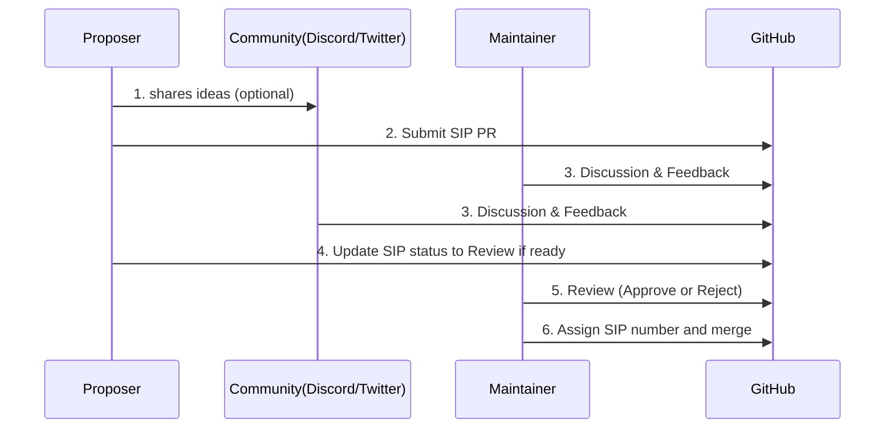
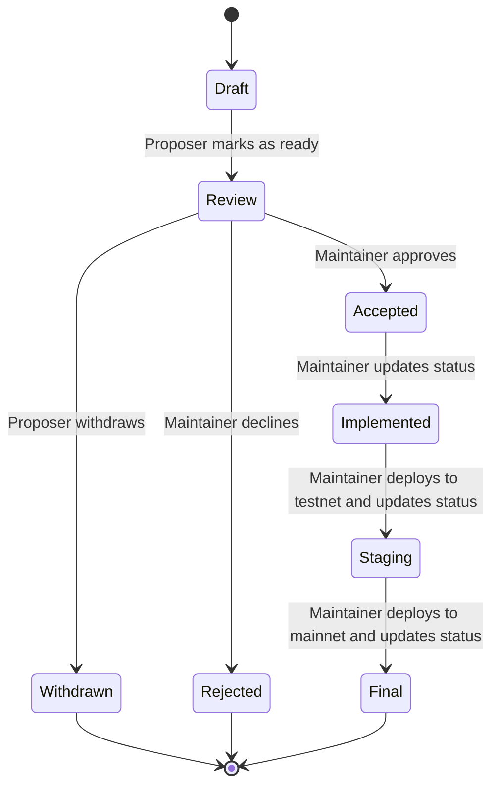

| Field              |Description                 |
|--------------------|----------------------------|
| **SIP**            | 1                          |
| **Title**          | SIP Process and Guidelines |
| **Author**         | Team TSS                   |
| **Discussions-to** | N.A                        |
| **Status**         | Final                      |
| **Category**       | Informational              |
| **Created**        | 2025-Jun-4                 |
| **Maintainer**     | Team TSS                   |

# SIP-1: SIP Process and Guidelines

## Abstract

This document establishes the Symbol Improvement Proposal (SIP) process. It defines how proposals are created, reviewed, and accepted, and includes roles, categories, status flows, and templates to guide authors, maintainers, and the broader community.

## Current Situation

Currently, there is no standardized process for proposing changes to Symbol. As a result, community members often find it difficult to contribute ideas or understand how proposals are reviewed and adopted.

## Proposed Changes

- Establish a standardized SIP process and markdown template.
- Define clear roles and responsibilities for authors and maintainers.
- Use GitHub as the central hub for SIP tracking and discussions.

## Rationale

The Symbol community regularly generates valuable ideas, but many contributors are unsure how to formally submit or advocate for changes. Discussions often happen in informal channels like Discord or Twitter and are quickly lost. This proposal provides a clear, transparent, and collaborative pathway for meaningful contributions to Symbol's evolution.

## Implementation

### SIP Workflow

1. The proposer shares idea and gathers feedback from the community (egDiscord, Twitter, etc.). This step is optional but recommended.

2. The proposer creates a draft SIP using the provided template and submits a pull request to the SIPs repository.

3. The maintainer and community discuss the proposal within the pull request, providing feedback and suggestions.

4. When the proposer believes the SIP is ready for formal review, they can update the SIP status to "Review".

5. Once a maintainer approves the proposal, they change the status to "Accepted". If not approved, the status is changed to "Rejected".

6. The maintainer assigns the final SIP number when the SIP is merged into the main branch.

### SIP Categories
- **Core**: Protocol-level changes requiring forks.
- **Networking**: Node configuration or networking behavior.
- **Interface**: API (e.g., REST) or SDK-level changes.
- **Library**: Updates to client libraries (npm, Python, etc.).
- **Application**: Application related changes (Explorer, wallet, etc.).
- **Informational**: Non-binding proposals or documentation guidelines.

### SIP Statuses Workflow

### SIP Statuses
- **Draft**: Initial version under development. The proposer is still working on the proposal and nobody else is expected to contribute. The proposer will change the status to Review when ready.
- **Review**: Open for review by maintainers and the community. Anybody can contribute. A maintainer will change the status to Accepted or Rejected when a decision is made. The proposer can also set the status to Withdrawn at any point.
- **Accepted**: Approved by the maintainers and planned for future implementation.
- **Rejected**: Declined by maintainers or community consensus. The proposal will not be pursued further.
- **Withdrawn**: The proposer has withdrawn the proposal. It's no longer under consideration.
- **Implemented**: The proposal has been fully implemented in code and is ready for deployment in testnet environment. The maintainer will update the status to Implemented.
- **Staging**: The proposal has been deployed to testnet for live testing. The maintainer will update the status to Staging.
- **Final**: The proposal has been successfully deployed to mainnet. The maintainer will update the status to Final.

## References

- [Bitcoin Improvement Proposals (BIPs)](https://github.com/bitcoin/bips)
- [Ethereum Improvement Proposals (EIPs)](https://github.com/ethereum/EIPs)
- [Symbol Proposal Notes by @ymuichiro](https://gist.github.com/ymuichiro/5037f4231ca753b42d622036047e67eb)